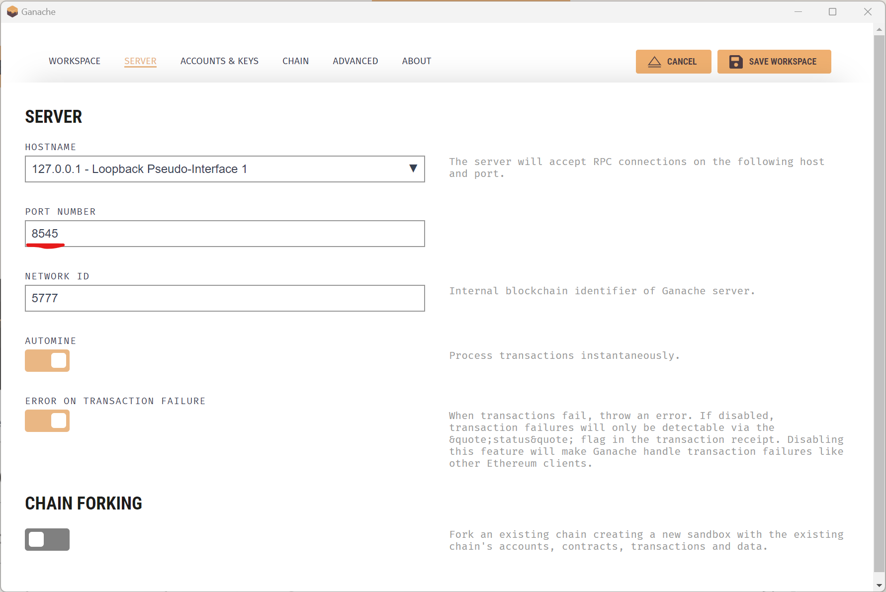
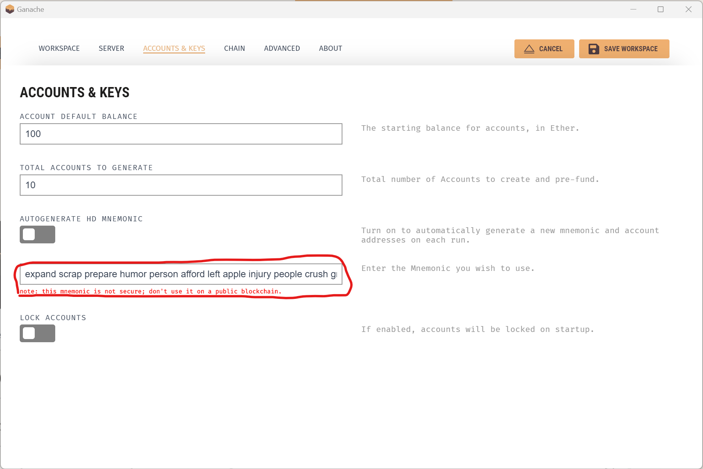

# Non-Fungible Tokens (NFTs) with Intellectual Property Rights (IPR) proved by digital signature

Before running the scripts you must download the required packages and install brownie.
<code>pip3 install -r requirements.txt</code>
To install brownie you can follow the instructions from the [official documentation](https://eth-brownie.readthedocs.io/en/stable/install.html).

---

## Setting up the environment

1. Install and run [Ganache](https://trufflesuite.com/ganache/).

2. Select "NEW WORKSPACE".

3. On the "SERVER" tab set the port to 8545.

4. On the "ACCOUNT & KEYS" tab, copy the mnemonic.

5. Click "SAVE WORKSPACE".

6. Open "settings.ini" file and paste the mnemonic to "Mnemonic" attribute.

7. Open a terminal and from inside the "NFTBlockchain" directory,
    run <code>brownie run ./scripts/deploy.py</code>

8. Copy the address of deployed smart contract and paste it in "settings.ini" file in to the "Address" attribute

9. Download and run [Go-IPFS](https://github.com/ipfs/kubo/releases?page=4). Suggested version 0.7.0 (Installation instructions are in the README file inside the zip file).
You must run the ipfs daemon. Run on terminal:
    - <code>ipfs init</code>
    - <code>ipfs daemon</code>

10. 