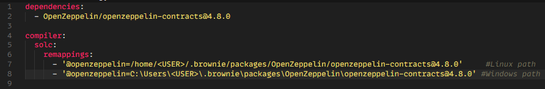
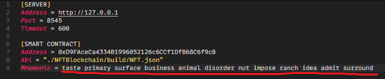
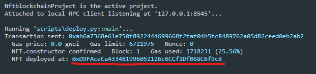
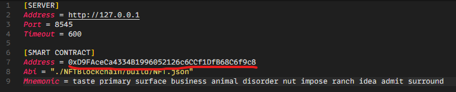
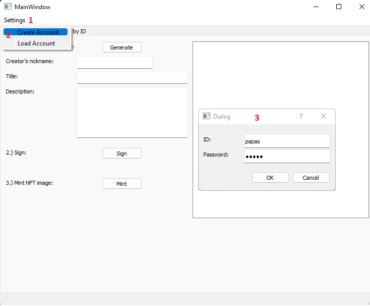

# Non-Fungible Tokens (NFTs) with Intellectual Property Rights (IPR) proved by digital signature

Before running the scripts you must download the required packages and install brownie.
<code>pip3 install -r requirements.txt</code>
or
<code>pip install -r requirements.txt</code>.
To install brownie you can follow the instructions from the [official documentation](https://eth-brownie.readthedocs.io/en/stable/install.html).

---

## Setting up the environment
1. Download OppenZeppelin contracts. In a terminal run <code>brownie pm install OpenZeppelin/openzeppelin-contracts@4.8.0</code>

2. Depending on your OS (Linux/Windows) edit the "brownie-config.yaml" file inside the "NFTBlockchain" directory. Insert the full path of the OpenZeppelin contracts. e.g.:

    Where \<USER> fill your user's name.

3. Install and run [Ganache](https://trufflesuite.com/ganache/).

4. Select "NEW WORKSPACE".

5. On the "SERVER" tab set the port to 8545.

6. On the "ACCOUNT & KEYS" tab, copy the mnemonic.

7. Click "SAVE WORKSPACE".

8. Open "settings.ini" file and paste the mnemonic to "Mnemonic" attribute.

9. Open a terminal and from inside the "NFTBlockchain" directory,
    run <code>brownie run ./scripts/deploy.py</code>
    (Windows: <code>brownie run .\scripts\deploy.py</code>)

10. Copy the address of deployed smart contract and paste it in "settings.ini" file in to the "Address" attribute

11. Download and run [Go-IPFS](https://github.com/ipfs/kubo/releases?page=4). Suggested version 0.7.0 (Installation instructions are in the README file inside the zip file).
You must run the ipfs daemon. Run on terminal:
    - <code>ipfs init</code>
    - <code>ipfs daemon</code>

---
## Running the application

1. Run the application: <code>python NFT.py</code>.

2. Load account:
    - If you run the application for the first time you have to create a brownie account by going to <code>Settings menu-> Create Account</code>:
    

    - If you already have a brownie account, you can load it by going to <code>Settings menu-> Load Account</code>:

3. Create NFT:
    On the "Generate NFT" tab:
    1. Click "Generate" button to create a random image.
    2. Fill out the information (author, title etc).
    3. Click "Sign" button to sign the data.
    4. Click "Mint" button to mint the NFT

4. Get NFT:
    To retrieve an NFT that is minted go to the "Get NFT by ID" tab:
    - Insert NFT ID and press the button "Get NFT".